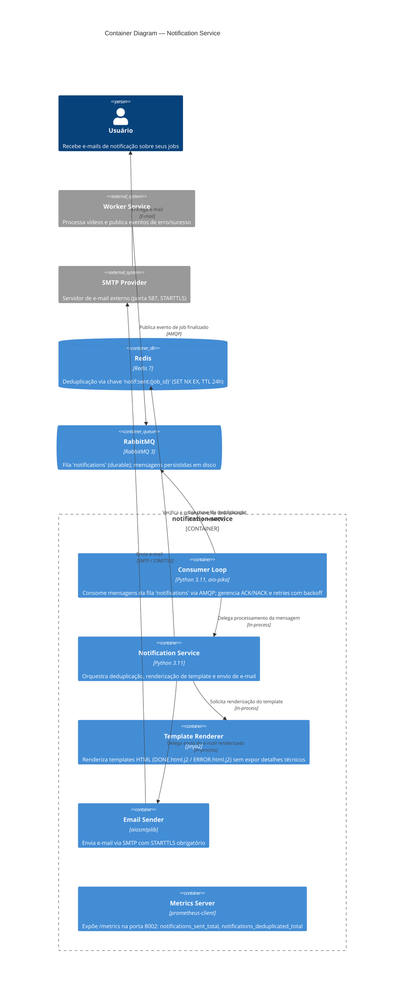

# C4 Container Diagram — Notification Service

**Nível**: Container (C4 Nível 2)  
**Serviço**: `notification-service`  
**Atualizado**: 2026-03-13

---

---

## Elementos

| Elemento | Tipo | Tecnologia | Responsabilidade |
|----------|------|-----------|-----------------|
| Consumer Loop | Container | Python + aio-pika | Consume AMQP, gerencia ACK/NACK, backoff de reconexão |
| Notification Service | Container | Python | Orquestra fluxo: dedup → template → envio |
| Template Renderer | Container | Jinja2 | HTML sem stack traces / dados internos |
| Email Sender | Container | aiosmtplib | SMTP async com STARTTLS |
| Metrics Server | Container | prometheus-client | `/metrics` porta 8002 |
| Redis | ContainerDb | Redis 7 | Deduplicação idempotente (SET NX EX) |
| RabbitMQ | ContainerQueue | RabbitMQ 3 | Fila `notifications` durable |

## Decisões de design

- Sem banco de dados relacional próprio — `user_email` vem na mensagem (responsabilidade do Worker)
- Deduplicação Redis garante idempotência em ambiente multi-réplica
- Consumer usa `basic_nack(requeue=True)` para falhas transitórias e `basic_nack(requeue=False)` após `MAX_NOTIFICATION_RETRIES`
