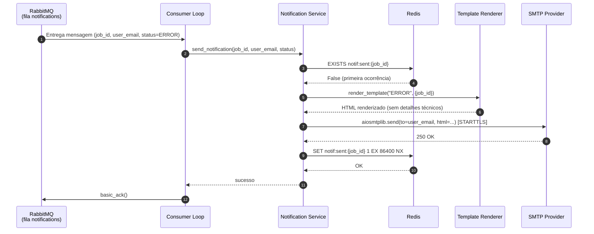
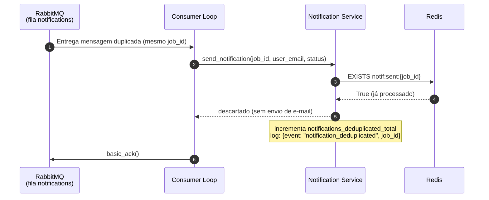
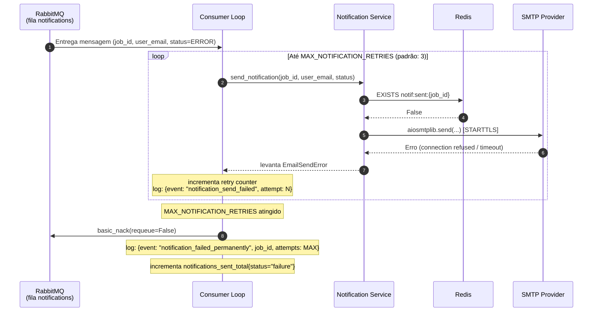

# Sequence Diagrams — Notification Service

**Serviço**: `notification-service`  
**Cobertura**: Happy path P1 + erros críticos  
**Atualizado**: 2026-03-13

---

## Fluxo 1 — Happy Path: E-mail enviado com sucesso

---

## Fluxo 2 — Deduplicação: Mensagem duplicada descartada

---

## Fluxo 3 — Falha SMTP com retries esgotados

---

## Resumo dos fluxos

| Fluxo | Trigger | Resultado final |
|-------|---------|----------------|
| Happy path | Mensagem nova + SMTP OK | E-mail enviado, `basic_ack` |
| Deduplicação | `job_id` já em Redis | Sem e-mail, `basic_ack` |
| Falha SMTP + retries esgotados | SMTP indisponível N vezes | `basic_nack(requeue=False)`, log permanente |
